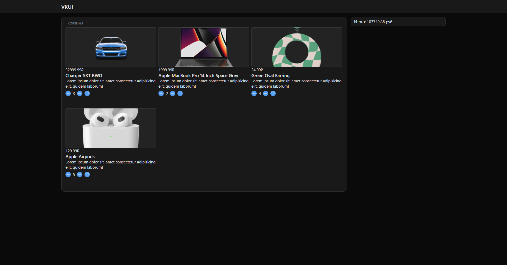

# VK market

Точного задания не сохранилось, но суть была в написании корзины для маркета, в которой отображаются карточки товаров и подсчитывается итоговая стоимость.
Опционально необходимо было использовать state manager и UI Kit (рекомендовали присмотреться к VKUI).

